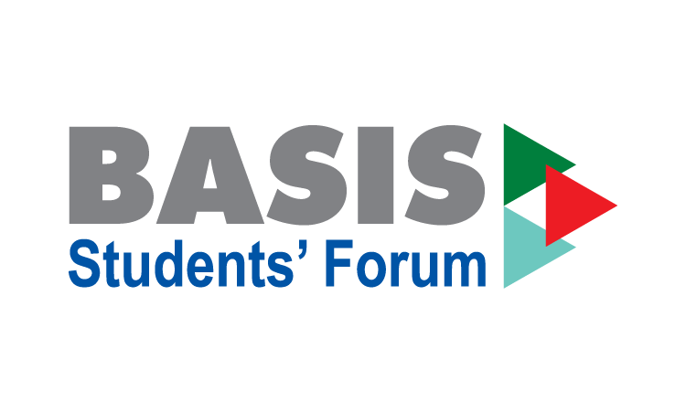

# Volunteering 
<!--  
 

 -->

<!-- <h3 align="left">Organization:</h3>

    

<!--
|   | Period of work (mm/yyyy - mm/yyyy) |
|:---------:|:----------------------------------:|
| Position 1 | Description about position 1 |

|  | Period of work (mm/yyyy - mm/yyyy) |
|:---------:|:----------------------------------:|
| Position 2 | Description about position 2 |

|  | Period of work (mm/yyyy - mm/yyyy) |
|:---------:|:----------------------------------:|
| Position 3 | Description about position 3 |
-->

|   |  |
|:---------:|:----------------------------------:|
